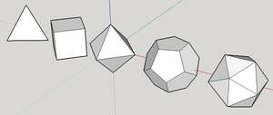
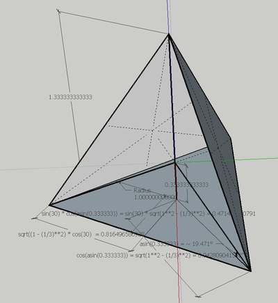
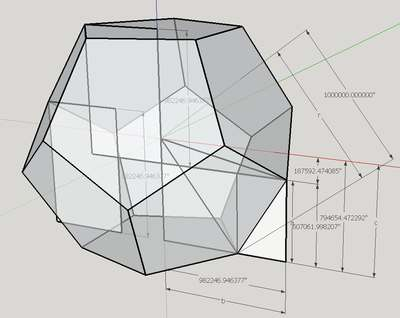
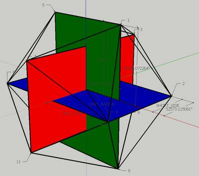

#SketchUp plugin to draw regular polyhedra
## Introduction
This plugin draws the five Platonic solids:
- Tetrahedron
- Octahedron
- Cube
- Dodecahedron
- Icosahedron.

-><-

It works in SketchUp v8 M2 or later, including SU2013 and SU2014 on Windows. I can't test it on Mac, but I bleieve it should work there too.

I hope later to add code for the stellated regular polyhedra.

## Usage
Install the plugin in the usual way (see notes at [reference needed]).

You should now find an extra item in the Draw menu, Polyhedra with a submenu for each shape as listed above.

After clicking on the selected shape, you will be prompted whether to specify the size by the length of one side of the shape, or by its radius (the radius of a circumscribed sphere).

A second prompt will ask for the size, either Side or Radius as previously set.

## Calculations
I tried first to calculate the location of polhedron vertices algebraically, and was able to do so easily for several of them (see code and comments in _polyhedra.rb_). 

But some of the fomulae given in Wikipedia (e.g., for the location of the vertices of a Tetrahedon centred on the origin) are just wrong, and others were not helpful in locating the centres of other polyhedra.

So I resorted to construction in Sketchup, at a very large scale (unit radius of 1,000,000 inches, with model info set to display five figures after the decimal point), used the Tape Measure tool to scale the model to an exact size of either radius or edge, and used the Dimension tool to measure key dimensions. See:

-><-

and

-><-

and 

-><-

Details of how to construct Dodecahedron and Icosahedron in SketchUp, using rectangles with sides in the Golden Ratio (1 : (1+ sqrt(5))/2), were very helpful: see for example: 

[Dodecahedron](https://www.google.co.uk/url?sa=t&rct=j&q=&esrc=s&source=web&cd=2&cad=rja&uact=8&ved=0CDkQtwIwAQ&url=http%3A%2F%2Fwww.youtube.com%2Fwatch%3Fv%3DQL6O-icBxdE&ei=oGs8U4moH8W1hAfW0oHYCQ&usg=AFQjCNHdqdr0VrrMgTmgnKrRsJeq2U4iUA&sig2=wV6q7qbf22aCXmdSs5GgKA&bvm=bv.63934634,d.ZG4 "SketchUp Dodecahedron tutorial").

[Icosahedron](https://www.youtube.com/watch?v=3TWRvqVgCEI "SketchUp Dodecahedron tutorial")

